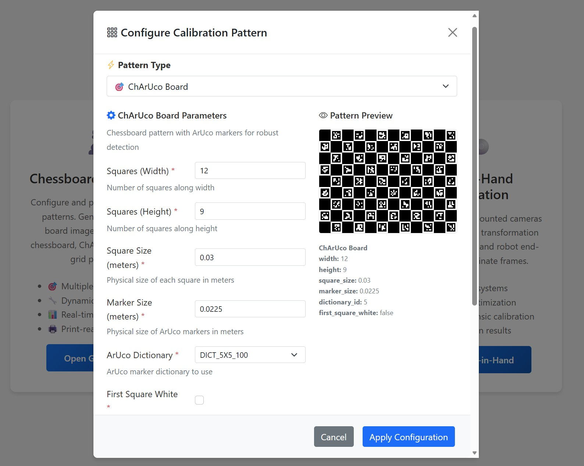
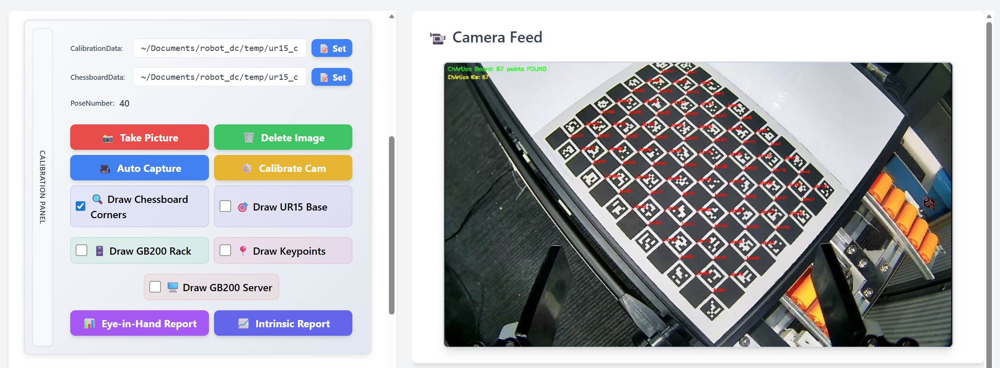
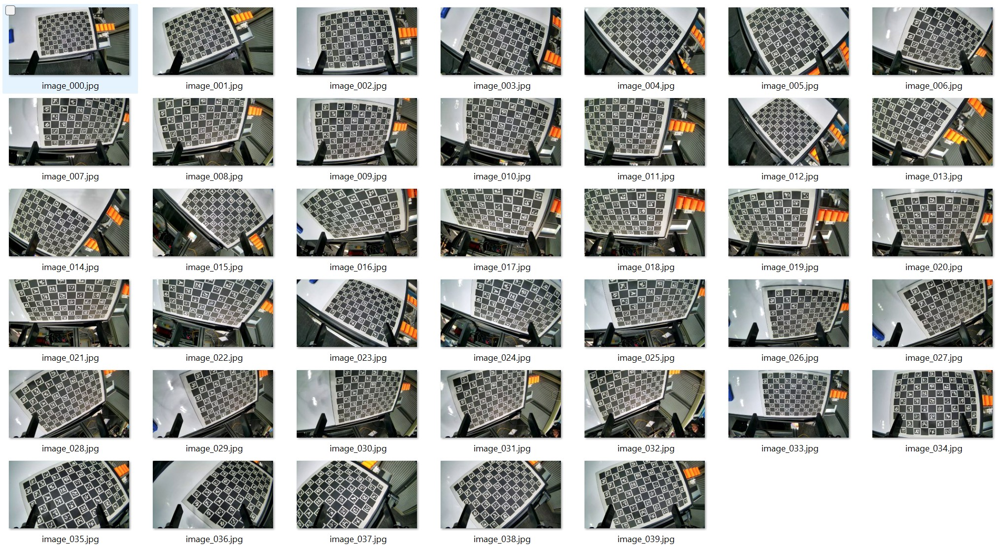
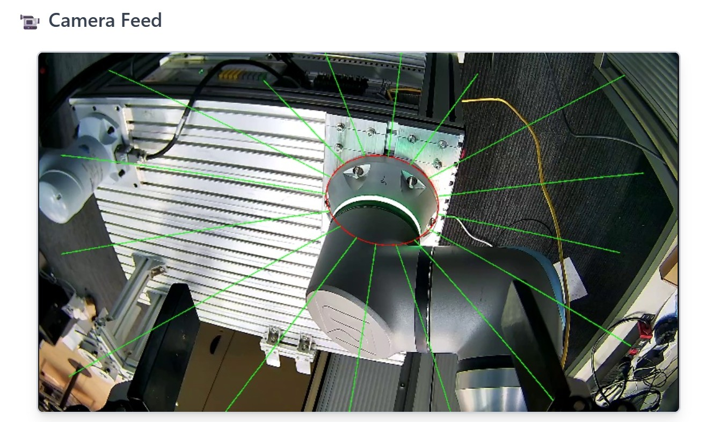

# Hand-Eye Calibration Guide

This document describes the full hand-eye (eye-in-hand) calibration process for the UR15 robot arm camera system.

---

## Prerequisites

- UR15 system launched: `ros2 launch robot_bringup ur15_bringup.py`
- A printed chessboard or ChArUco board
- Camera feed visible at `http://<host>:8030`

---

## 1. Create Calibration Pattern Configuration

Before collecting images, you need a chessboard configuration file that matches your physical board.

1. Open the Camera Calibration Web at `http://<host>:8006`
2. Go to the **Pattern Generator** page
3. Configure the pattern parameters (rows, columns, square size, etc.) to match your physical chessboard



4. Download the generated JSON configuration file
5. Place it at `temp/ur15_cam_calibration_data/chessboard_config.json`

The configuration will be loaded automatically the next time you launch the UR15 system.

---

## 2. Calibration UI Overview

Open the UR15 web dashboard at `http://<host>:8030`. The calibration interface provides real-time camera feed, robot state, and calibration controls:



Before taking pictures, enable **Draw Chessboard Corners** to visualize detected corners in real time on the camera feed. This helps you verify that the chessboard is fully visible and properly detected before each capture.

---

## 3. Collect Calibration Images (Manual Capture)

Move the robot arm in freedrive mode to capture images of the chessboard from various angles and distances. **Take at least 30 images** to ensure sufficient coverage.

Tips for good calibration data:
- Cover the full field of view — move the board to corners and edges of the image
- Vary the distance and tilt angle between captures
- Ensure the chessboard pattern is fully visible and in focus in each image
- Avoid motion blur — hold steady before capturing

The collected images and corresponding robot poses are saved to `temp/ur15_cam_calibration_data/`.

Reference for a good set of calibration images:



---

## 4. Auto Capture (Re-capture to Avoid Shaking)

After the manual capture, use the **Auto Capture** function to re-visit the same poses and capture again automatically. This eliminates hand shake and ensures sharper images with precise pose alignment.

The auto capture process:
1. The robot moves back to each previously recorded pose
2. Waits for stabilization
3. Captures the image automatically
4. Proceeds to the next pose

This replaces the manual images with cleaner, shake-free versions while keeping the same poses.

---

## 5. Calibrate Camera

Run the calibration from the web UI at `http://<host>:8030`, or use the script:

```bash
python3 scripts/ur_cam_calibrate.py
```

The calibration performs:
1. **Intrinsic calibration** — computes camera matrix and distortion coefficients from chessboard detections
2. **Hand-eye calibration** — computes the transform from camera to end-effector (cam2end) using paired robot poses and image data

Results are saved to `temp/ur15_cam_calibration_result/`.

---

## 6. Review Calibration Reports

After calibration, review the generated reports to assess quality:

- **Reprojection error** — should be < 1.0 pixel (ideally < 0.5). High values indicate poor image quality or inconsistent detections
- **Camera matrix** — verify focal lengths and principal point are reasonable for your camera
- **Distortion coefficients** — check that values are within expected ranges
- **Hand-eye transform** — the rotation and translation from camera to end-effector should be physically plausible

If the reprojection error is too high, consider:
- Removing outlier images and re-calibrating
- Collecting more images with better coverage
- Checking that the chessboard config matches the physical board

---

## 7. Validate Accuracy with Base Projection

To verify the calibration result, use the **base projection** feature in the UR15 web dashboard at `http://<host>:8030`.

This projects the robot arm's base coordinate frame onto the camera image using the calibrated parameters. If the calibration is accurate, the projected base frame should align with the actual base position as seen in the camera.



Check that:
- The projected origin aligns with the robot base in the image
- The axes directions are correct
- The projection remains stable as the robot moves

If the projection is misaligned, the hand-eye calibration may need to be redone with better data.
