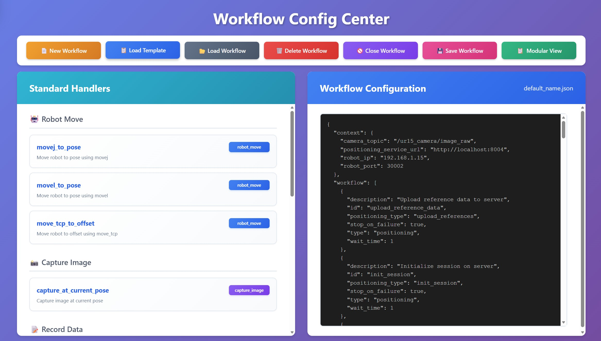
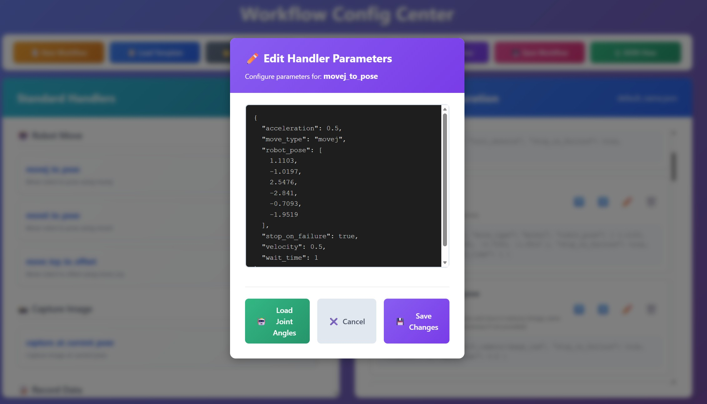

# Rack Calibration Guide

This document describes how to calibrate the GB200 server rack position using the UR15 robot arm's multi-view 3D positioning system. The process has three stages — the first two are preparation (done once), and the third is the online execution (repeated as needed).

---

## Prerequisites

- UR15 system launched: `ros2 launch robot_bringup ur15_bringup.py`
- Hand-eye calibration completed (see [handeye_calibration.md](handeye_calibration.md))
- Robot Vision (FlowFormer++) server running and URL configured in `config/robot_config.yaml`:
  ```yaml
  services:
    positioning_3d:
      ffpp_url: "http://<vision-machine-ip>:8101"  # http:// prefix is required
  ```
- The robot is placed at the working position. 

---

## Stage 1: Create a Dataset (One-time Preparation)

In this stage, you capture reference images of the rack's 4 corners and label them. This dataset is used by the positioning service to track these points in new views.

### 1.1 Capture Reference Images

Open the UR15 web dashboard at `http://<host>:8030`. Place the robot at its working position and enable freedrive mode.


In the **Dataset Panel**:

1. Set **OperationName** to `rack_top` and click **Set**
2. Move the robot to look at the top of the rack, then click **Capture Reference 1**

### 1.2 Label Top Corners


1. Click **Go To Label Latest Reference 1** — this opens the image labeling tool at `:8007`
2. Label the keypoint **`GB200_Rack_Top_Left_Corner`**
3. Label the keypoint **`GB200_Rack_Top_Right_Corner`**
4. Click **Save to Server**

### 1.3 Capture and Label Remaining Corners

Repeat the process above to capture images that cover all four corners. The positioning system references corners by name, so corner names must match exactly (case-sensitive):

The following corner names are used by the default workflow template (`workflow_example_positioning_fitting.json`). You must use these exact names (case-sensitive) so that the workflow can match labeled keypoints to the 3D model points during fitting:

- `GB200_Rack_Top_Left_Corner`
- `GB200_Rack_Top_Right_Corner`
- `GB200_Rack_Bottom_Left_Corner`
- `GB200_Rack_Bottom_Right_Corner`

If you use different names, you must also update the `template_points` in the workflow accordingly.

The number of images is flexible — each image should contain at least one keypoint, the same corner could be labeled in multiple images. For best results, capture clear images where the corners are easy to identify.

---

## Stage 2: Create a Workflow (One-time Preparation)

In this stage, you configure a positioning workflow that defines the robot poses for capturing views of the rack and the 3D fitting parameters.

### 2.1 Load Workflow Template

1. Click **Go To Workflow Config Center** to open the workflow dashboard
2. Click **Load Template** and select `workflow_example_positioning_fitting.json`
3. Give the workflow a name if needed



### 2.2 Configure Workflow

Switch to **Modular View** for easier inspection and editing. Modify the following parameters:

- **`movej_to_pose`** — Enable freedrive mode, move the robot to the desired observation poses, then record the joint values into the workflow



- **`upload_view` → `reference_name`** — Adjust if your reference names differ (default: `rack_bottom_left`, `rack_top_left`, etc.)
- **`get_result_fitting` → `template_points`** — Define the 3D model points for fitting:

```json
"template_points": [
  {"name": "GB200_Rack_Bottom_Left_Corner", "x": 0, "y": 0, "z": 0},
  {"name": "GB200_Rack_Bottom_Right_Corner", "x": 0.55, "y": 0, "z": 0},
  {"name": "GB200_Rack_Top_Left_Corner", "x": 0, "y": 0, "z": 2.145},
  {"name": "GB200_Rack_Top_Right_Corner", "x": 0.55, "y": 0, "z": 2.145}
]
```

These coordinates define the rack geometry in local frame (meters). Adjust to match your physical rack dimensions (see `shared.GB200_rack` in `robot_config.yaml`).

### 2.3 Add Intermediate Waypoints

The `movej_to_pose` command moves the robot via joint-space linear interpolation, which may cause collisions with the rack in tight spaces. To avoid this, insert additional `movej_to_pose` entries as intermediate waypoints to control the robot's path between observation poses.

### 2.4 Save Workflow

Click **Save Workflow**. The JSON file is stored and can be reused for all future calibrations.

---

## Stage 3: Run Workflow on the Dashboard

This is the operational stage — run the saved workflow from the web dashboard to compute the rack position. Use this when you want a one-click interactive run with the camera overlay verification.

### 3.1 Execute Workflow

In the **Workflow Panel** of the UR15 dashboard (`http://<host>:8030`):

1. Click **Refresh** to reload the workflow list
2. Select the saved JSON workflow file
3. Click **Run Current Selected Workflow**

The workflow will:
1. Upload reference data to the positioning service
2. Initialize a positioning session
3. Move the robot to each configured pose
4. Capture images and upload views
5. Compute the 3D rack position via model fitting
6. Save the result (`rack2base_matrix`) to robot status

Progress and completion status are streamed back to the dashboard's log panel.

### 3.2 Verify Results

In the web dashboard, enable **Draw GB200 Rack** to overlay the 3D rack model on the live camera feed.

If the projected rack aligns with the physical rack in the image, the calibration is successful. The computed `rack2base_matrix` (rack-to-robot-base transformation) is stored in robot status and available for downstream tasks.

---

## Stage 4: Run Workflow with a Script

Running the workflow from a terminal (instead of the dashboard) is useful for:

- Debugging — full stdout/stderr is visible in the terminal
- Batch/scripted runs (e.g. automated tests, CI, calibration sweeps)
- Headless operation when no browser is available
- Reusing rack calibration inside other Python programs

The repo ships a thin wrapper, [scripts/ur_rack_calibration.py](../scripts/ur_rack_calibration.py), that drives the same `ros2 run ur15_workflow run_workflow.py` command the dashboard's **Run Current Selected Workflow** button uses, then reads the resulting `rack2base_matrix` and `rack_points_3d` back from the robot status service.

### 4.1 Quick Start — Use the Wrapper Script

Saved workflows live under `temp/workflow_files/` in the workspace. Pass the basename:

```bash
python3 scripts/ur_rack_calibration.py localize_rack_at_working_pos.json
```

Or an absolute path:

```bash
python3 scripts/ur_rack_calibration.py /abs/path/to/<workflow_file>.json
```

The script:

1. Spawns `ros2 run ur15_workflow run_workflow.py --config <resolved_path>` and streams its output to the terminal.
2. After successful completion, fetches `rack2base_matrix` and `rack_points_3d` from robot status (Redis, namespace `ur15`).
3. Pretty-prints both arrays.

Exit codes: `0` success · `2` workflow file not found · `3` cannot reach Redis · `4` `rack2base_matrix` not in status · `127` `ros2` not on PATH · otherwise the workflow's own non-zero return code.

### 4.2 Use as a Library — `RackCalibrator` Class

The wrapper exposes a reusable class so rack calibration can be triggered from other scripts/services:

```python
from ur_rack_calibration import RackCalibrator

cal = RackCalibrator()
cal.set_config('localize_rack_at_working_pos.json')   # basename or abs path
rc = cal.run()                                        # runs the ros2 workflow synchronously
result = cal.get_result()                             # dict of result arrays

matrix = result['rack2base_matrix']                   # 4x4 numpy.ndarray (or None)
points = result['rack_points_3d']                     # 4x3 numpy.ndarray (or None)
```

Or in one line:

```python
result = RackCalibrator(config='localize_rack_at_working_pos.json').calibrate()
```

Key members:

| Member | Description |
| --- | --- |
| `RackCalibrator(config=None, namespace='ur15', result_keys=('rack2base_matrix', 'rack_points_3d'), status_client=None)` | Constructor. All args optional; pass `status_client` to inject a custom/mock `RobotStatusClient`, or `result_keys` to fetch a different set of status keys. |
| `set_config(config)` | Resolve a basename (under `temp/workflow_files/`) or absolute path. Raises `FileNotFoundError` if missing. |
| `run()` → `int` | Spawn `ros2 run ur15_workflow run_workflow.py --config <path>`. Returns the exit code. Raises `RuntimeError` if no config set, `FileNotFoundError` if `ros2` is not on PATH. |
| `get_result()` → `dict` | Read all configured `result_keys` from robot status and return them as a dict (values are `numpy.ndarray` or `None` if not stored). Does **not** run the workflow — call this anytime to inspect the last computed result. |
| `calibrate()` → `Optional[dict]` | Convenience: `run()` followed by `get_result()`. Returns `None` if the workflow exited non-zero. |
| `config` (property) | Currently configured absolute workflow path, or `None`. |
| `last_returncode` (property) | Exit code of the most recent `run()`, or `None`. |

Because `get_result()` is independent of `run()`, you can also use the class purely to read the most recent calibration result without re-running the workflow:

```python
result = RackCalibrator().get_result()   # latest stored values
matrix = result['rack2base_matrix']
```

### 4.3 Underlying Commands (For Reference)

If you want to bypass the wrapper, the same operations are available as raw commands:

```bash
# Equivalent to RackCalibrator.run()
ros2 run ur15_workflow run_workflow.py \
    --config /home/robot/Documents/robot_dc/temp/workflow_files/<workflow_file>.json

# Validate the workflow without moving the robot
ros2 run ur15_workflow run_workflow.py --config <workflow_file>.json --dry-run

# Equivalent HTTP call (mirrors the dashboard button exactly)
curl -X POST http://<host>:8030/run_workflow \
  -H 'Content-Type: application/json' \
  -d '{"workflow_file": "<workflow_file>.json"}'
```

The runner prints each operation's status (`✓ Completed`, `✗ Failed`, `⊘ Skipped`) and a final summary. On success, `rack2base_matrix` and `rack_points_3d` are written to robot status under namespace `ur15`.

