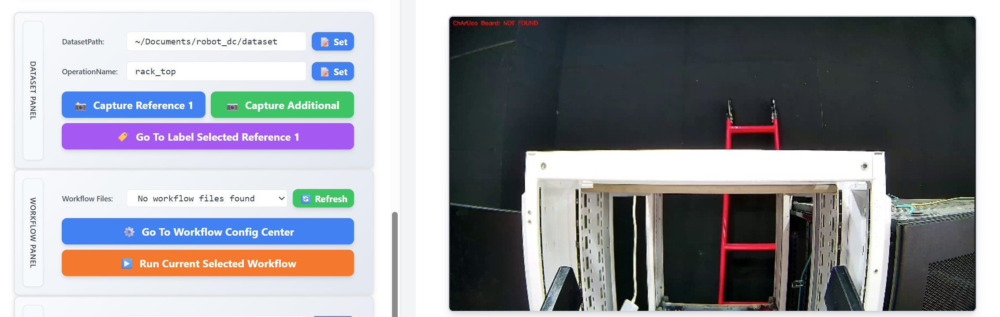
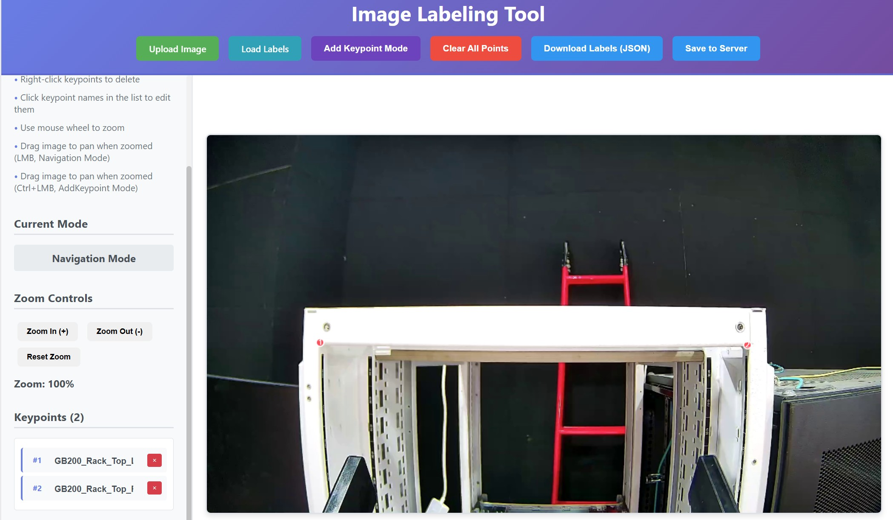

# Rack Calibration Guide

This document describes how to calibrate the GB200 server rack position using the UR15 robot arm's multi-view 3D positioning system. The process has three stages — the first two are preparation (done once), and the third is the online execution (repeated as needed).

---

## Prerequisites

- UR15 system launched: `ros2 launch robot_bringup ur15_bringup.py`
- Hand-eye calibration completed (see [handeye_calibration.md](handeye_calibration.md))
- Robot Vision (FlowFormer++) server running and URL configured in `config/robot_config.yaml`:
  ```yaml
  services:
    positioning_3d:
      ffpp_url: "http://<vision-machine-ip>:8101"  # http:// prefix is required
  ```
- The robot is placed at the working position. 

---

## Stage 1: Create a Dataset (One-time Preparation)

In this stage, you capture reference images of the rack's 4 corners and label them. This dataset is used by the positioning service to track these points in new views.

### 1.1 Capture Reference Images

Open the UR15 web dashboard at `http://<host>:8030`. Place the robot at its working position and enable freedrive mode.



In the **Dataset Panel**:

1. Set **OperationName** to `rack_top` and click **Set**
2. Move the robot to look at the top of the rack, then click **Capture Reference 1**

### 1.2 Label Top Corners



1. Click **Go To Label Latest Reference 1** — this opens the image labeling tool at `:8007`
2. Label the keypoint **`GB200_Rack_Top_Left_Corner`**
3. Label the keypoint **`GB200_Rack_Top_Right_Corner`**
4. Click **Save to Server**

### 1.3 Capture and Label Remaining Corners

Repeat the process above to capture images that cover all four corners. The positioning system references corners by name, so corner names must match exactly (case-sensitive):

- `GB200_Rack_Top_Left_Corner`
- `GB200_Rack_Top_Right_Corner`
- `GB200_Rack_Bottom_Left_Corner`
- `GB200_Rack_Bottom_Right_Corner`

The number of images is flexible — each image should contain at least one keypoint. For best results, capture clear images where the corners are easy to identify.

---

## Stage 2: Create a Workflow (One-time Preparation)

In this stage, you configure a positioning workflow that defines the robot poses for capturing views of the rack and the 3D fitting parameters.

### 2.1 Load Workflow Template

1. Go to the **Workflow Panel** in the web dashboard, or open the Workflow Config Center at `http://<host>:8008`
2. Click **Load Template** and select `workflow_example_positioning_fitting.json`
3. Rename the file if needed

### 2.2 Configure Workflow

Modify the workflow parameters:

- **`movej_to_pose`** — Use freedrive mode to move the robot to desired observation poses, then record the joint values into the workflow
- **`upload_view` → `reference_name`** — Adjust if your reference names differ (default: `rack_bottom_left`, `rack_top_left`, etc.)
- **`get_result_fitting` → `template_points`** — Define the 3D model points for fitting:

```json
"template_points": [
  {"name": "GB200_Rack_Bottom_Left_Corner", "x": 0, "y": 0, "z": 0},
  {"name": "GB200_Rack_Bottom_Right_Corner", "x": 0.55, "y": 0, "z": 0},
  {"name": "GB200_Rack_Top_Left_Corner", "x": 0, "y": 0, "z": 2.145},
  {"name": "GB200_Rack_Top_Right_Corner", "x": 0.55, "y": 0, "z": 2.145}
]
```

These coordinates define the rack geometry in local frame (meters). Adjust to match your physical rack dimensions (see `shared.GB200_rack` in `robot_config.yaml`).

### 2.3 Save Workflow

Click **Save Workflow**. The JSON file is stored and can be reused for all future calibrations.

---

## Stage 3: Run Workflow Online (Repeated Each Time)

This is the operational stage — run the saved workflow to compute the rack position.

### 3.1 Execute Workflow

In the **Workflow Panel**:

1. Click **Refresh** to reload the workflow list
2. Select the saved JSON workflow file
3. Click **Run Current Selected Workflow**

The workflow will:
1. Upload reference data to the positioning service
2. Initialize a positioning session
3. Move the robot to each configured pose
4. Capture images and upload views
5. Compute the 3D rack position via model fitting
6. Save the result (`rack2base_matrix`) to robot status

**Troubleshooting**: If the workflow fails, run it via CLI for detailed error output:

```bash
ros2 run ur15_workflow run_workflow --config <workflow_file>.json
```

### 3.2 Verify Results

In the web dashboard at `http://<host>:8030`, enable **Draw GB200 Rack** to overlay the 3D rack model on the live camera feed.

If the projected rack aligns with the physical rack in the image, the calibration is successful. The computed `rack2base_matrix` (rack-to-robot-base transformation) is stored in robot status and available for downstream tasks.
